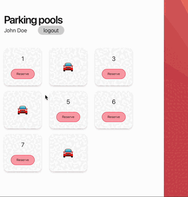

# ParkingPool

Prototype of a parking space reserving app.
Backend is made with Elixir, frontend is Svelte because why not. TailwindCSS for CSS.
Microsoft Login is used for authentication.



Click on parking spaces to reserve them. Connect with any number
of browsers and parking spaces synchronise between them. Parking spaces
are freed automatically (timeout is just a minute right now for testing purposes!)

Parking space states are stored in memory, so there is no persistence between restarts. 

### Building and running locally with docker:
You can run the project with docker, however its a production build so there
is only Azure AD authentication, no dev login. See below on setting up Azure AD authentication.
```
docker build -t parking_pool .
docker run -p 4000:4000 -e SECRET_KEY_BASE=JCPmhSbWKDffcupksvBMPpOD60ziz2BqDR8zUK1K7rWPY9HcLWl1EsbJIre5xo+a -it parking_pool
```

### Requirements:
- Elixir & Erlang
- Node

### Installation:
- Elixir and Erlang can be installed with brew or asdf.
  At the time of writing newest versions are:
  - erlang 25.2.2
  - elixir 1.14.3-otp-25

### Fetch dependencies:
- `mix deps.get`
- `cd apps/parking_pool_web && mix setup`

### Startup:
- `mix phx.server`, or `iex -S mix phx.server` (to connect to iex console)
Now you can visit [`localhost:4000`](http://localhost:4000) from your browser.

### Some notes on code and structure
Main business logic resides in apps/parking_pool,
in `apps/parking_pool/lib/parking_pool/parking_space.ex`.
Application spins up this process for each parking space, which controls its own
state and timing.

Web interface is in `apps/parking_pool_web`. Uses Phoenix framework for Rest endpoints
and websockets.

- Websockets: `apps/parking_pool_web/lib/parking_pool_web/socket/parking_channel.ex`
- Api controllers: `apps/parking_pool_web/lib/parking_pool_web/controllers/api_controller.ex`
- Frontend: `apps/parking_pool_web/assets/js`

### Azure AD authentication
You can specify the keys required either in `config/dev.exs` (for running locally)
or as environment variables for production build / running with docker.

The environment variables are:
- `MICROSOFT_LOGIN_TENANT_ID`
- `MICROSOFT_LOGIN_CLIENT_ID`
- `MICROSOFT_LOGIN_CLIENT_SECRET`

It's pretty easy to setup Azure AD with your personal live account for testing locally.
Some options required in Azure Portal:
- Authentication
  - Web --> Redirect URIs: http://localhost:4000/auth/microsoft/callback
  - ID tokens (used for implicit and hybrid flows)
- API permissions
  - openid, profile, User.Read might be required, though not sure
  
# TODO:
- ~~Dockerfile~~ 
- Ability to configure for production (number of parking spaces, default reservation time etc)
- ~~Authentication with Microsoft~~
- Show ~~name~~ and time of reservation
- Improve responsiveness
- Improve UI and design
- ~~Prevent canceling other peoples reservations~~
- ...
- Persistence (not a high priority at this time I think)


## Learn more
Ready to run in production? Please [check our deployment guides](https://hexdocs.pm/phoenix/deployment.html).

* Official website: https://www.phoenixframework.org/
* Guides: https://hexdocs.pm/phoenix/overview.html
* Docs: https://hexdocs.pm/phoenix
* Forum: https://elixirforum.com/c/phoenix-forum
* Source: https://github.com/phoenixframework/phoenix
